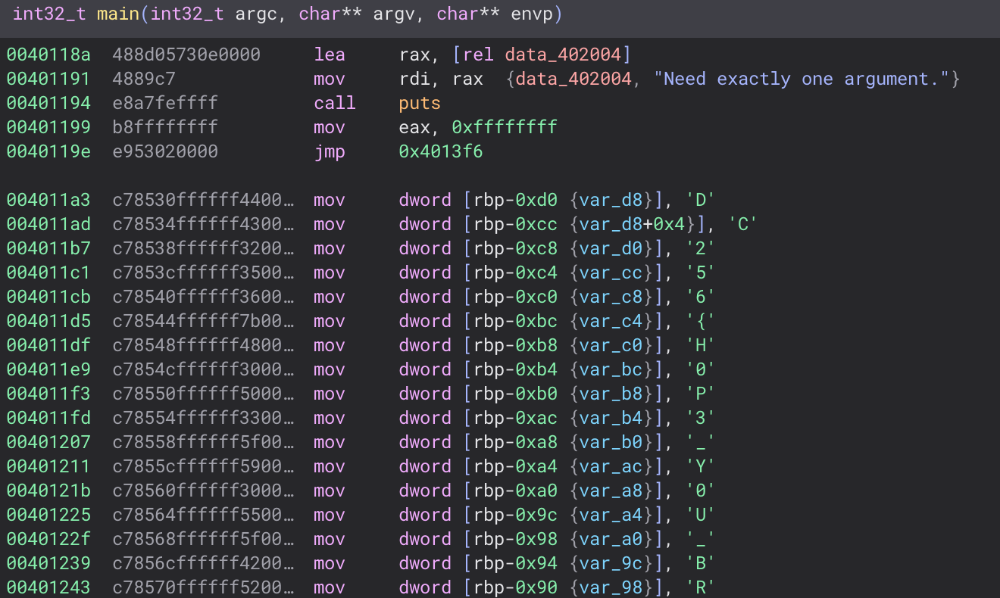

# Crackme 2
Category: Reversing
Points: 200(?)
Provided: crackme2

Challenge Description:
Ok, maybe that first one was a little too easy. Now we have for sure secured our password checker!

## Solution

 * This one requires a little bit more tinkering, and perhaps opening in a decompilier 
 * After opening, hopefully you will see that your decompiler has solved most of it for you, and you just have to type the flag.
 
  Picture:
   

## Notes

 * Still meant to be somewhat easy, but not too trivial. Requires at least opening in a debugger or using GDB and poking around
 * You can also use GDB, break at a certain point, then just print the flag, since it is needed for strncmp 

## Hints

 * IDA Free or GDB will be useful, anything to explore the code

