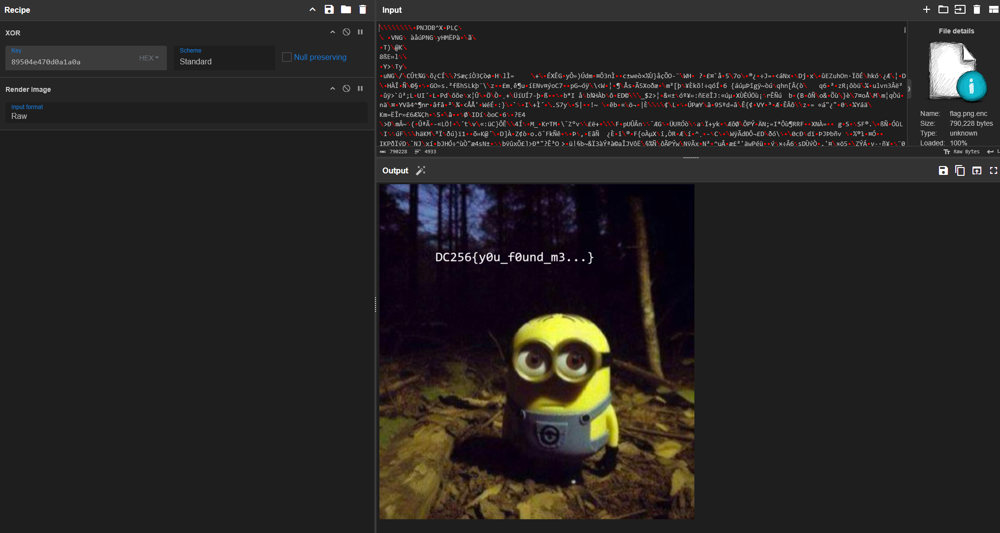
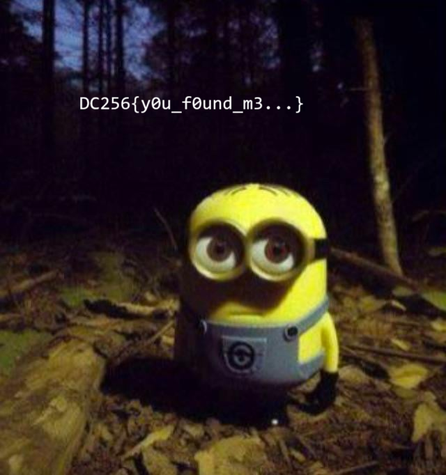

# Despicable Encryption
The file is encrypted by XOR'ing the entire file by the magic bytes of a PNG file.
  
This is partially evident because the first few bytes of the encrypted file are null bytes (00)- whenever you xor something by itself, the result is zero.

https://ctf101.org/cryptography/what-is-xor/

The easiest way to solve this is by using CyberChef:

## Flag:

