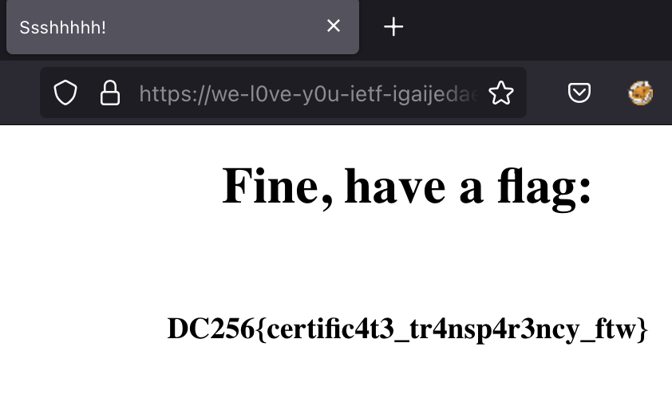

This challenge relies on using [Certificate Transparency](https://en.wikipedia.org/wiki/Certificate_Transparency) reporting.

You can find the secret URL by searching for `ropchain.party` on https://crt.sh, which will lead you here: https://crt.sh/?id=18372218276.

On that page, you see where a LetsEncrypt certificate was requested for the domain `we-l0ve-y0u-ietf-igaijedaejeequ0veishohwe.ropchain.party`.

Upon visiting that page, you see the flag: 